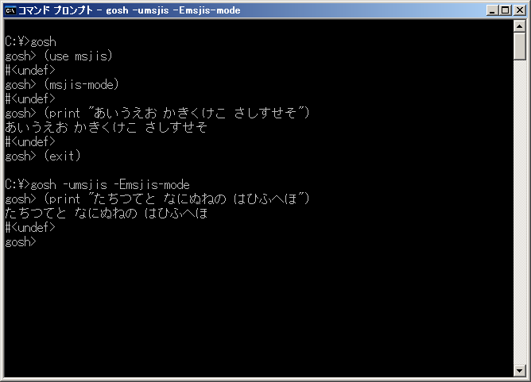

# msjis



## 概要
- Windows のコマンドプロンプトで Gauche を使うときに、  
  日本語 (CP932) の表示と入力を可能とするモジュールです。


## インストール方法
- msjis.scm を Gauche でロード可能なフォルダにコピーします。  
  (例えば (gauche-site-library-directory) で表示されるフォルダ等)


## 使い方
- 以下を実行します。
  ```
    (use msjis)
    (msjis-mode)
  ```
  以後、(print "あいうえお") 等で日本語を表示できます。

- msjis-mode の引数  
  msjis-mode にはオプションで以下の引数を指定できます。  
  `msjis-mode [rmode] [ces] [use-api]`
  - 第1引数の rmode には、リダイレクト時の動作を指定します。  
    以下の値を指定可能です。省略時は 0 を指定したことになります。
    
    ```
    0 : リダイレクト時には変換なし(デフォルト)
    1 : リダイレクト時には改行コード変換(LF→CRLF)あり
    2 : リダイレクト時には文字コード変換(CP932等の変換)あり
    3 : リダイレクト時には文字コード変換(CP932等の変換)と改行コード変換(LF→CRLF)あり
    ```
  - 第2引数の ces には、変換する文字エンコーディングを指定します。  
    以下の値を指定可能です。省略時は #f を指定したことになります。
    
    ```
    #f     : 変換する文字エンコーディングを自動設定する(※1)(デフォルト)
    'CP932 : 変換する文字エンコーディングを CP932 とする(※2)
    'SJIS  : 変換する文字エンコーディングを SJIS とする(※3)
    'UTF-8 : 変換する文字エンコーディングを UTF-8 とする(※4)
    
    (※1) コンソールのコードページの情報を取得して、ces を自動設定します。
    (※2) 日本語版 Windows のデフォルトです。
    (※3) 文字エンコーディングの CP932 と SJIS とでは、使用可能な文字が一部異なります。
          また、変換できない文字があったときの処理結果が異なります。
          (注意事項の 3. を参照ください)
    (※4) コマンドプロンプトのみでは、正常に動作しません。
          (注意事項の 4. を参照ください)
    ```
  - 第3引数の use-api には、コンソールの入出力に  
    Windows API (ReadConsole, WriteConsole) を使用するかどうかを指定します。  
    Windows API を使用すると、ユニコードの文字が使用可能になるケースがあります。  
    (詳細は注意事項の 4. を参照ください)  
    以下の値を指定可能です。省略時は #f を指定したことになります。  
    (ただし、ces に 'UTF-8 が自動で設定された場合には、例外的に #t を指定したことになります)
    
    ```
    #f : Windows API を使用しない(デフォルト(※1))
    #t : Windows API を使用する(※2)
    
    (※1) ces に 'UTF-8 が自動で設定された場合には、例外的に #t を指定したことになります。
    (※2) 本設定 (#t) は、Gauche v0.9.4 以降でないと正常に動作しません。
          また、Gauche が内部エンコーディング utf-8 でコンパイルされていなければ、
          正常に動作しません。
          また、リダイレクト時には有効になりません。
          また、Windows XP では、文字化けが発生することがあります。
    ```

- 個別の変換ポートが必要な場合  
  個別の変換ポートが必要な場合には、以下を使用してください。
  ```
    (make-msjis-stdin-port)   標準入力の変換ポートを作成して返します
    (make-msjis-stdout-port)  標準出力の変換ポートを作成して返します
    (make-msjis-stderr-port)  標準エラー出力の変換ポートを作成して返します
  ```
  これらの手続きには msjis-mode と同じ引数を指定できます。  
  また、これらの手続きは、変換が不要な場合には #f を返すため注意してください。


## 注意事項
1. コンソールの標準入力、標準出力、標準エラー出力についてのみ文字コードが変換されます。

2. 1文字ずつ変換するため、その分の時間がかかります。

3. msjis-mode の第2引数に 'CP932 を指定した場合には、iconv という外部ライブラリで  
   変換が行われます。このときは、変換できない文字があると、エラーが発生します。  
   (iconvの仕様による)  
   一方、msjis-mode の第2引数に 'SJIS を指定した場合には、Gauche の内部で  
   変換が行われます。このときは、変換できない文字があっても、エラーにはなりません。  
   (げた記号等に変換されます)

4. (以下の記述は、Windows 8.1 (64bit), Gauche v0.9.5 でのみ動作確認しています)  
   現状、コマンドプロンプト上でユニコードの文字を使おうとして、chcp 65001 により、  
   コードページ CP65001 (UTF-8) を選択しても、正常に機能しません。  
   (日本語フォントが選択できない。MS-IMEが起動しない等の問題が発生します)  
   しかし、コンソールエミュレータの ConEmu ( https://conemu.github.io/ ) 等を利用すれば、  
   コードページ CP65001 (UTF-8) を選択して、おおむね問題なくユニコードの文字を  
   使うことができます。  
   この環境で Gauche を使う場合には、msjis-mode の第3引数に #t を指定してください。  
   (指定しないと、文字の後ろにゴミが付加されたり、プログラムが終了したりします)  
   以下に ConEmu 上での実行手順の例を示します。
   ```
     chcp 65001
     gosh
     (use msjis)
     (msjis-mode 0 'UTF-8 #t)
     (print #\u0100#\u0101)
     (print #\u03B1#\u03B2#\u03B3#\u03BB)
   ```
   (備考) ConEmu 上で、1行の文字数が多いときに全角文字が重なって表示される場合には、  
   ConEmu の Settings メニュー で Main を選択し、その中の設定を確認してください。  
   「Compress long strings to fit space」のチェックを外すと、とりあえずフォントの  
   重なりは解消されます。  
   ただし、この設定を行うと、コードページ CP65001 (UTF-8) の場合には、全角文字を含む  
   行の表示が画面に入りきらないケースが発生します。  
   現状では、これは、トレードオフになります。  
   
   (備考) サロゲートペアの文字 (#\u20B9F の「しかる」、#\u1F363 の「すし」(絵文字) 等)  
   については、Gauche v0.9.4 以前では表示できません。Gauche v0.9.5 では表示できます。  
   ただし、カーソル移動で2文字分移動しないと前後の文字に移動できません。  
   また、サロゲートペアの文字については、画面の右端での折り返しが正常に行われない  
   ケースがあるようです(文字が消えたり化けたりします)。  
   
   (備考) コードページ CP932 のままでも、ユニコードの文字を表示できるようです。  
   (仕様なのかバグなのか分からないが。。。)  
   この場合、行の折り返しは一見正常になりますが、サロゲートペアの文字があると、  
   1文字を2文字分とカウントして折り返してしまいます。


## 参考情報
1. コマンドプロンプトで Gauche プログラミング - 主題のない日記  
   http://saito.hatenablog.jp/entry/2014/04/14/104006  
   (ここのコードを元に改造、デバッグしました)

2. How to redirect STDOUT generated using WriteConsole in kernel32.dll?  
   http://social.msdn.microsoft.com/Forums/vstudio/en-US/716f2f70-9eed-4b96-9f43-f967605f307f/how-to-redirect-stdout-generated-using-writeconsole-in-kernel32dll?forum=netfxbcl  
   (Win32 API の ReadConsole(),WriteConsole() は、リダイレクトありのときは使えない。  
    リダイレクトの有無は GetConsoleMode() が成功するかどうかで判定できる)

3. Incorrect Unicode output on Windows Console  
   https://ghc.haskell.org/trac/ghc/ticket/4471  
   (コマンドプロンプトで CP65001 (UTF-8) を選択したときに不具合が発生する。  
    具体的には、WriteFile() の結果がフォントによって、文字数を返したり バイト数を  
    返したりする。対策としては、WriteFile() の替わりに WriteConsole() を使うことが  
    挙げられる)

4. ReadConsole function (Community Additions : ReadConsole writes an extra byte)  
   https://msdn.microsoft.com/en-us/library/windows/desktop/ms684958  
   (ReadConsole() がバッファサイズより1バイト多く書き込む)  
   (現在コメント欄が見られなくなっているようです)

5. Windows XP で ReadConsole() を使用すると、文字化けが発生することがある。  
   (行頭の文字が「g」に化ける)  
    → 2015-2-2 追試したら再現しないため、修正されたか、もしくは、何か発生条件が  
    あるのかもしれない。  
    → 2015-2-15 再現した。昨年より頻度は減ったような気がする。

6. Gauche v0.9.3.3 では、ReadConsole(),WriteConsole() のラッパーの  
   sys-read-console,sys-write-console が正常に動作しない。  
   (Gauche v0.9.4 では修正済み)


## 環境等
- OS
  - Windows 8.1 (64bit)
  - Windows XP Home SP3
- 言語
  - Gauche v0.9.5
  - Gauche v0.9.4
  - Gauche v0.9.3.3

## 履歴
- 2014-6-2   v1.00 (初版)
- 2014-6-4   v1.01 Windows XPで行頭の文字が「g」に化けてエラーになる場合がある件の対策
- 2014-6-4   v1.02 デバッグ表示埋め込み(今はコメントアウトしてある)
- 2014-6-4   v1.03 CP932の2バイト文字のチェックを修正
- 2014-6-7   v1.04 コメント修正のみ
- 2014-6-9   v1.05 1文字入出力の処理を整理  
  古い環境用にmsjis-repl2とmsjis-mode2を追加(エラーが発生する場合あり)
- 2014-6-10  v1.06 デバッグ表示処理整理(今はコメントアウトしてある)
- 2014-6-11  v1.07 Bad file descriptorエラーの対策  
  1文字入出力の処理方法2を採用  
  これにともないmsjis-repl2とmsjis-mode2は削除
- 2014-6-11  v1.08 exportの削除もれ修正
- 2014-6-13  v1.09 コメント修正のみ
- 2014-6-24  v1.10 コメント修正のみ
- 2014-6-24  v1.11 コメント修正のみ
- 2014-7-22  v1.12 リダイレクト時の動作の設定を追加
- 2014-7-22  v1.13 ファイル終端(EOF)のチェック処理修正
- 2014-8-6   v1.14 一部処理見直し
- 2014-8-7   v1.15 一部処理見直し
- 2014-8-8   v1.16 インデント修正のみ
- 2014-9-11  v1.17 msjis-replを削除、make-msjis-stdin-port, make-msjis-stdout-port, make-msjis-stderr-portを追加
- 2014-9-13  v1.18 一部処理見直し
- 2014-9-13  v1.19 コメント修正のみ
- 2014-9-23  v1.20 一部処理見直し
- 2014-11-22 v1.21 コメント修正のみ
- 2014-11-26 v1.22 msjis-modeに第2引数(オプション引数)を追加
- 2014-12-4  v1.23 インデント修正のみ
- 2015-2-2   v1.24 マルチバイト文字の判定方法見直し  
  ReadConsole(),WriteConsole()の使用引数追加  
  文字エンコーディングのチェック処理追加
- 2015-2-5   v1.25 ReadConsole() がバッファサイズより1バイト多く書き込む件に対応
- 2015-2-11  v1.26 u8vectorのコピー範囲指定追加
- 2015-2-11  v1.27 u8vectorのコピー削減
- 2015-2-11  v1.28 1文字入出力の処理見直し
- 2015-2-11  v1.29 1文字入力の処理見直し
- 2015-2-11  v1.30 コメント修正のみ
- 2015-2-11  v1.31 一部処理見直し
- 2015-2-11  v1.32 1文字入力の処理見直し
- 2015-2-11  v1.33 デバッグ表示用修正
- 2015-2-21  v1.34 CP65001(UTF-8)対応の処理見直し
- 2015-2-23  v1.35 1文字入出力の処理見直し
- 2016-2-23  v1.36 msjis-modeの第3引数の名称変更と処理見直し等
- 2016-3-9   v1.37 ces未指定時には、コードページの情報を取得して、cesを自動設定するようにした
- 2016-3-10  v1.38 一部処理見直し
- 2016-3-15  v1.39 コメント修正のみ
- 2016-3-16  v1.40 1文字入力の処理見直し等
- 2016-3-17  v1.41 Gaucheの内部エンコーディングがsjisのときのエラー対策
- 2016-3-17  v1.42 変数名変更
- 2016-3-24  v1.50 サロゲートペアの文字の折り返しの不具合対策  
  Gaucheの内部エンコーディングがsjisのときのエラー対策
- 2016-3-24  v1.51 Gaucheの内部エンコーディングがsjisのときのエラー対策
- 2016-4-15  v1.52 一部処理見直し(sys-write-console-sub)
- 2016-4-22  v1.53 一部処理見直し(sys-read-console)
- 2016-10-14 v1.54 一部処理見直し(make-msjis-putc削除,msjis-modeの戻り値変更)
- 2016-11-25 v1.55 Windows API の使用フラグ処理修正等
- 2017-1-8   v1.56 プログラム構成一部見直し等


(2017-1-8)
