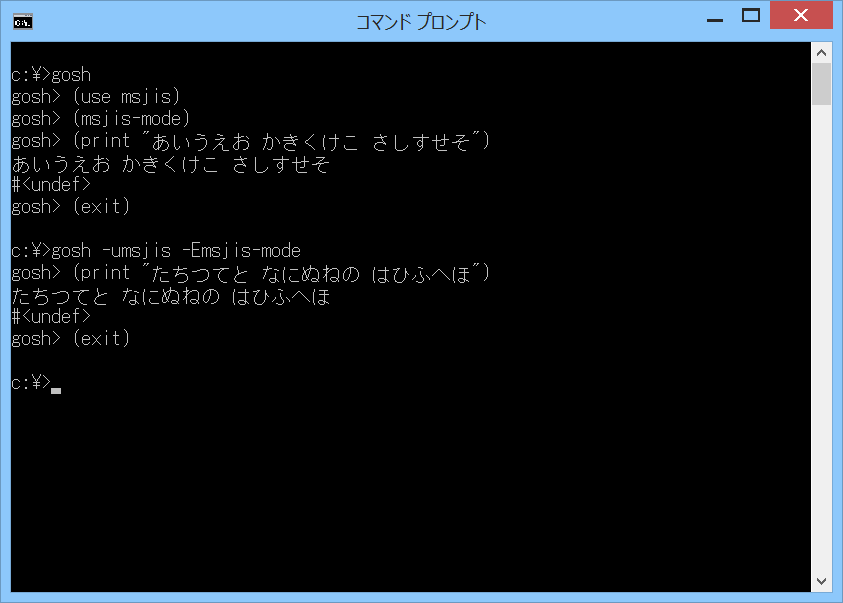

# msjis



## 概要
- Windows のコマンドプロンプトで Gauche(gosh.exe) を使うときに、  
  日本語(CP932)の表示と入力を可能とするモジュールです。


## インストール方法
- msjis.scm を Gauche でロード可能なフォルダにコピーします。  
  (例えば (gauche-site-library-directory) で表示されるフォルダ等)


## 使い方
- 以下を実行します。
  ```
    (use msjis)
    (msjis-mode)
  ```
  以後、(print "あいうえお") 等で日本語を表示できます。

- msjis-mode の引数  
  msjis-mode にはオプションで以下の引数を指定できます。  
  `msjis-mode [rmode] [ces] [userwc]`
  - 第1引数の rmode には、リダイレクト時の動作を指定します。  
    以下の値を指定可能です。省略時は0を指定したことになります。
    
    ```
    0 : リダイレクト時には変換なし(デフォルト)
    1 : リダイレクト時には改行コード変換(LF→CRLF)あり
    2 : リダイレクト時には文字コード変換(CP932等の変換)あり
    3 : リダイレクト時には文字コード変換(CP932等の変換)と改行コード変換(LF→CRLF)あり
    ```
  - 第2引数の ces には、変換する文字エンコーディングを指定します。  
    以下の値を指定可能です。省略時は'CP932を指定したことになります。
    
    ```
    'CP932 : 変換する文字エンコーディングをCP932とする(デフォルト)
    'SJIS  : 変換する文字エンコーディングをSJISとする
    ```
    変換する文字エンコーディングがCP932の場合には、iconvという外部ライブラリによって  
    変換が行われます。このときは、CP932に存在しない文字を変換すると、エラーが発生します。  
    (iconvの仕様による)  
    一方、変換する文字エンコーディングがSJISの場合には、Gaucheの内部で変換が行われます。  
    このときは、SJISに存在しない文字を変換しても、エラーにはなりません。  
    (げた記号等に変換されます)  
    ただし 文字エンコーディングのSJISとCP932では、使用可能な文字が一部異なるため、  
    変換結果が変わる場合があります。  
    (SJISの方が JIS X 0213 をカバーしており範囲が広いもよう。  
     しかし、CP932のみで使用可能な文字も一部存在する。  
     (例えば シフトJISコード 0x8794 の数学記号のシグマ等))

  - 第3引数の userwc には、リダイレクトなしの場合に、  
    Win32 API の ReadConsole(),WriteConsole() を使用するかどうかを指定します。  
    以下の値を指定可能です。省略時は #f を指定したことになります。
    
    ```
    #t : ReadConsole(),WriteConsole()を使用する
    #f : ReadConsole(),WriteConsole()を使用しない(デフォルト)
    ```
    本機能は、コマンドプロンプトでコードページ CP65001(UTF-8) を選択した場合に発生する  
    不具合を解消するために使用できます。  
    (CP65001(UTF-8) 選択時には、ReadConsole(),WriteConsole() を使用しないと、  
     ゴミが付加されて表示されたり、Gaucheが強制終了したりします)  
    使用例として、CP65001(UTF-8) を選択して Lucida Console フォントで ギリシア文字を  
    表示する場合の手順を以下に示します。  
    (※) 本機能は、Gauche v0.9.4 以降でないと正常に動作しません  
    (※) CP65001(UTF-8) 選択時には、日本語フォントやMS-IMEは使用できません
    
    ```
    ＜手順＞
      (a)コマンドプロンプトで chcp 65001 を実行
      (b)コマンドプロンプトの画面左上のアイコンをクリックしてプロパティを開き、
         フォントタブで、フォントの Lucida Console を選択
      (c)コマンドプロンプトで以下を実行
           gosh
           (use msjis)
           (msjis-mode 0 'UTF-8 #t)
           (print #\u03B1#\u03B2#\u03B3#\u03BB)

    (※) 元に戻すには、(a)で chcp 932 を実行して (b)でラスタフォントを選択してください
    ```

- 個別の変換ポートが必要な場合  
  個別の変換ポートが必要な場合には、以下を使用してください。
  ```
    (make-msjis-stdin-port)   標準入力の変換ポートを作成して返します
    (make-msjis-stdout-port)  標準出力の変換ポートを作成して返します
    (make-msjis-stderr-port)  標準エラー出力の変換ポートを作成して返します
  ```
  これらの手続きには msjis-mode と同じ引数を指定できます。  
  また、これらの手続きは、変換が不要な場合には #f を返すため注意してください。


## 注意事項
1. コンソールの標準入力、標準出力、標準エラー出力についてのみ  
   文字コードが変換されます。

2. 1文字ずつ変換するため、その分の時間がかかります。

3. CP932に存在しない文字を変換するとエラーになります(iconvの仕様による)。  
   (例えば (print #\x100) 等)  
   エラーを発生させたくない場合には、msjis-modeの第2引数に'SJISを指定してください。  
   (上記「使い方」を参照ください)  


## 参考情報
1. コマンドプロンプトで Gauche プログラミング - 主題のない日記  
   http://saito.hatenablog.jp/entry/2014/04/14/104006  
   (ここのコードを元に改造、デバッグしました)

2. How to redirect STDOUT generated using WriteConsole in kernel32.dll?  
   http://social.msdn.microsoft.com/Forums/vstudio/en-US/716f2f70-9eed-4b96-9f43-f967605f307f/how-to-redirect-stdout-generated-using-writeconsole-in-kernel32dll?forum=netfxbcl  
   (Win32 API の ReadConsole(),WriteConsole() は、リダイレクトありのときは使えない。  
   リダイレクトの有無は GetConsoleMode() が成功するかどうかで判定できる)

3. Incorrect Unicode output on Windows Console  
   https://ghc.haskell.org/trac/ghc/ticket/4471  
   (コマンドプロンプトで CP65001(UTF-8) を選択したときに不具合が発生する)

4. ReadConsole function (Community Additions : ReadConsole writes an extra byte)  
   https://msdn.microsoft.com/en-us/library/windows/desktop/ms684958  
   (ReadConsole() がバッファサイズより1バイト多く書き込む)

5. Windows XP で ReadConsole() を使用すると、しばしば文字化けが発生する。  
   (行頭の文字が「g」に化ける。  
    → 2015-2-2 追試したら再現しないため、修正されたか、もしくは、  
    何か発生条件があるのかもしれない)

6. Gauche v0.9.3.3 では、WriteConsole() のラッパーの sys-write-console が正常に動作しない。  
   (Gauche側の文字コード変換ミスのため。Gauche v0.9.4 では修正ずみ)


## 環境等
- OS
  - Windows XP Home SP3
  - Windows 8 (64bit)
- 言語
  - Gauche v0.9.4
  - Gauche v0.9.3.3

## 履歴
- 2014-6-2   v1.00 (初版)
- 2014-6-4   v1.01 Windows XPで行頭の文字が「g」に化けてエラーになる場合がある件の対策
- 2014-6-4   v1.02 デバッグ表示埋め込み(今はコメントアウトしてある)
- 2014-6-4   v1.03 CP932の2バイト文字のチェックを修正
- 2014-6-7   v1.04 コメント修正のみ
- 2014-6-9   v1.05 1文字入出力の処理を整理  
  古い環境用にmsjis-repl2とmsjis-mode2を追加(エラーが発生する場合あり)
- 2014-6-10  v1.06 デバッグ表示処理整理(今はコメントアウトしてある)
- 2014-6-11  v1.07 Bad file descriptorエラーの対策  
  1文字入出力の処理方法2を採用  
  これにともないmsjis-repl2とmsjis-mode2は削除
- 2014-6-11  v1.08 exportの削除もれ修正
- 2014-6-13  v1.09 コメント修正のみ
- 2014-6-24  v1.10 コメント修正のみ
- 2014-6-24  v1.11 コメント修正のみ
- 2014-7-22  v1.12 リダイレクト時の動作の設定を追加
- 2014-7-22  v1.13 ファイル終端(EOF)のチェック処理修正
- 2014-8-6   v1.14 一部処理見直し
- 2014-8-7   v1.15 一部処理見直し
- 2014-8-8   v1.16 インデント修正のみ
- 2014-9-11  v1.17 msjis-replを削除、make-msjis-stdin-port, make-msjis-stdout-port, make-msjis-stderr-portを追加
- 2014-9-13  v1.18 一部処理見直し
- 2014-9-13  v1.19 コメント修正のみ
- 2014-9-23  v1.20 一部処理見直し
- 2014-11-22 v1.21 コメント修正のみ
- 2014-11-26 v1.22 msjis-modeに第2引数(オプション引数)を追加
- 2014-12-4  v1.23 インデント修正のみ
- 2015-2-2   v1.24 マルチバイト文字の判定方法見直し  
  ReadConsole(),WriteConsole()の使用引数追加  
  文字エンコーディングのチェック処理追加
- 2015-2-5   v1.25 ReadConsole() がバッファサイズより1バイト多く書き込む件に対応
- 2015-2-11  v1.26 u8vectorのコピー範囲指定追加
- 2015-2-11  v1.27 u8vectorのコピー削減
- 2015-2-11  v1.28 1文字入出力の処理見直し
- 2015-2-11  v1.29 1文字入力の処理見直し
- 2015-2-11  v1.30 コメント修正のみ


(2015-2-11)
